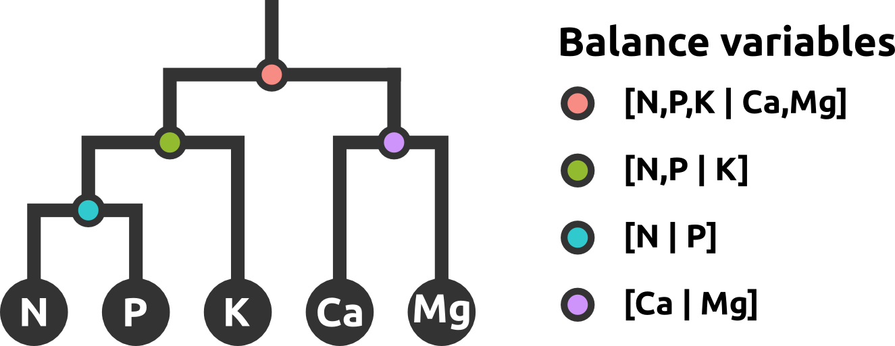
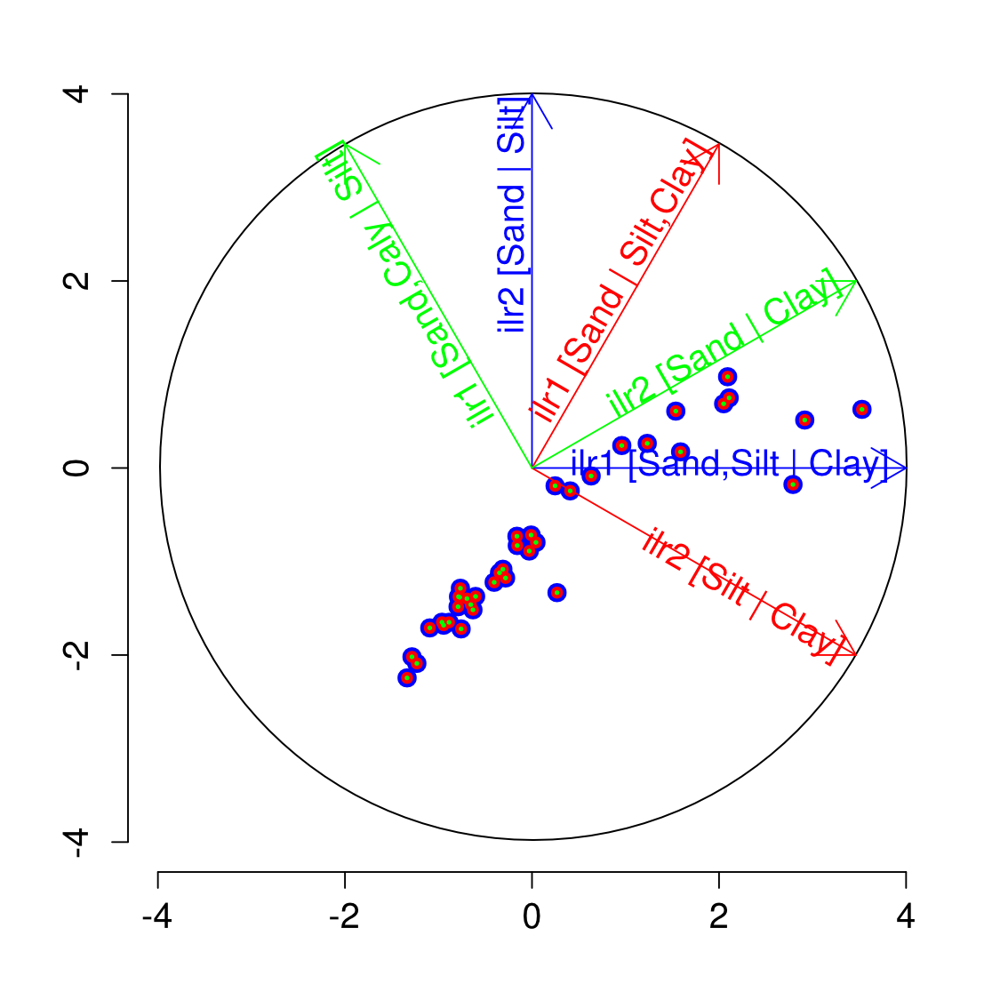
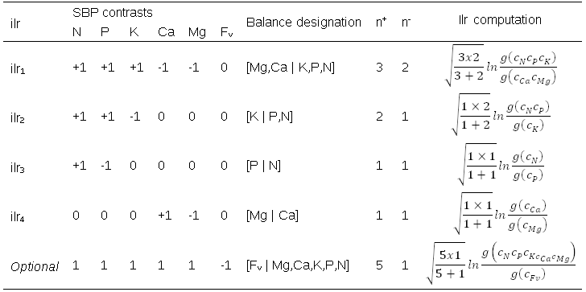

Introduction to compositions
============================

**Serge-Étienne Parent**

### Geostat-Course, Quebec city, 2013-05-29

# Compositional data (CoDa) analysis

Compositional data (CoDa) are intrinsically multivariate data assembled in vectors of positive components showing the relative importance of a set of components on a whole, e.g. proportions, probabilities, concentrations, red-green-blue proportions, etc. They sum to a constant (unity, 100%, 1 000 000 ppm, etc.) and range between 0 and this constant sum.

The closure operation, C, computes the constant sum assignment, as follows.

<a href="http://www.codecogs.com/eqnedit.php?latex=S^{D} = C(c_1, c_2, ..., c_D) = [\tfrac{c_1 \kappa }{\sum_{i=1}^{D}c_i}, \tfrac{c_2 \kappa }{\sum_{i=1}^{D}c_i}, ..., \tfrac{c_D \kappa }{\sum_{i=1}^{D}c_i} ]" target="_blank"></a>

CoDa have particular and important numerical properties and should be handled with care. Not convinced? Let's have a look at personal expenditures in the United States, in billions of $.

```{r}
data(USPersonalExpenditure)
expends1 <- t(USPersonalExpenditure)
colnames(expends1) <- c("Food & Tob.", "House. Op.", "Med. & Health", "Pers. Care", "Priv. Educ.")
rowSums(expends1)
cor(expends1)
```

Now, the correlation between expenditures as ratio on total measured expenditures.
```{r}
expends2 <- expends1 / rowSums(expends1)
cor(expends2)
```

And the correlation between expenditures as ratio, excluding "Food and Tobacco"" as well as "Household Operation".
```{r}
expends3 <- expends1[, 3:5] / rowSums(expends1[, 3:5])
cor(expends3)
```

And so on...

```{r}
expends4 <- expends1[, c(3,5)] / rowSums(expends1[, c(3,5)])
cor(expends4)
```

Now, the correlation is perfect. Indeed, if on increase by a certain fraction, the other one decreases with the same fraction.

The following table shows the correlation between "Private Education"" and "Medical and Health".

```{r}
data.frame(D = c(5, 5, 4, 3, 2), 
           Closure = c("Unclosed", "Closed", "Closed", "Closed", "Closed"),
           Correlation = c(cor(expends1)[5, 3],
                           cor(expends2)[5, 3],
                           cor(expends1[, 2:5] / rowSums(expends1[, 2:5]))[4, 2],
                           cor(expends3)[1, 3],
                           cor(expends4)[2, 1]))
```

The correlation depends on the basis we assume as analysts: total family expenses, home expenses, parental expenses, etc. Same data, different scales, retuning different correlations. This is what Pearson (1897) named **spurious correlations**. Ordinary log transformations would not correct the problem (try it!). Why? Because CoDa essentially convey relative information, and the constant sum forces at least one correlation coefficient to be negative. For example, in particle-size analysis, if sand increases, at least one of silt or clay **must** decrease, as can be observed in a ternary diagram.

```{r}
library(soiltexture)
TT.plot(class.sys = "USDA.TT")
```

That is why the Canadian soil texture classification drops the silt part, which can be computed by subtracting sand and clay from 100%.

```{r}
TT.plot(class.sys = "CA.EN.TT")
```

So, in addition to scale dependency, CoDa contain redundant information. In a simplex of *D* components, one component can be computed by subtracting the sum of the others from the constant sum. Accordingly, the simplex contains *D*-1 degrees of freedom.

Another source of bias is the distribution of CoDa. As the normal distribution scans the real space, the normality assumption is not valid. Normality is also not valid for ordinary log transformations, because the upper part is still unlimited.

Rock (1988) reported some problems that arise when using conventional statistics across CoDa, where he pointed out biases, little or no significance, illusory results, spurious effects and flawed tests. These issues are due to the properties of CoDa named previously:

1. are scale-dependant
2. contain redundant information
3. are not normally distributed

# CoDa transformation techniques

Fortunately, since John Aitchison published a book dedicated to CoDa in 1986, these issues can be easily tackled by using data transformations techniques such as *additive log-ratios (alr)*, *centered log-ratios (clr)* and *isometric log-ratios (ilr)*. 

## Additive log-ratio

The *alr* is a log-ratio between a component and a reference component *c^D*.

<a href="http://www.codecogs.com/eqnedit.php?latex=alr_j = ln \tfrac{c_i}{c_D} \: for \: j=1,2,...,D-1" target="_blank"></a>

The reference component can be selected arbitrary or in order to create an interpretable set of ratios. The choice of the selected component does not influence the results of linear statistics. However, it should be noted that *alr* variables are oblique to each other. Accordingly, distance-based analyses on *alrs* (PCoA, clustering, etc.) should be used with care.

## Centered log-ratio

The *clr* is a log-ratio between a component and the geometric mean of all components.

<a href="http://www.codecogs.com/eqnedit.php?latex=clr_i = ln \tfrac{c_i}{g(c)} \: for \: i=1,2,...,D" target="_blank"></a>

The sum of each *clr* row equals to zero, inducing several singularity issues. Moreover, *D* components generates *D* *clrs*, so *clrs* are not straight-forwardly interpretable variables (Aitchison and Greenacre, 2002).

## Isometric log-ratio

Ilrs can be based on a special device of balances or linearly independent ratios among nutrients called sequential binary partition (SBP). The SBP describes the *D*-1 orthogonal (geometrically independent) balances between parts and groups of parts. The SBP is a (*D*-1) × *D* matrix, in which parts labeled "+1" (group numerator) are balanced with parts labeled "-1" (group denominator). A part labeled "0" is excluded from the balance between parts. The composition is partitioned sequentially into contrasts at every hierarchically ordered row until the (+1) and (-1) groups each contain a single part.

For example,

```{r SBP1, results='asis', echo=FALSE}
df <- data.frame(Sand=c(1, 1), Silt=c(1, -1), Clay=c(-1, 0))
cat("Sand | Silt | Clay", "--- | --- | ---", sep="\n")
cat(apply(df, 1, function(X) paste(X, collapse=" | ")), sep = "\n")
```

Or

```{r SBP2, results='asis', echo=FALSE}
df <- data.frame(N  = c( 1, 1, 1, 0, 1),
                 P  = c( 1, 1,-1, 0, 1),
                 K  = c( 1,-1, 0, 0, 1),
                 Ca = c(-1, 0, 0, 1, 1),
                 Mg = c(-1, 0, 0,-1, 1),
                 Fv = c( 0, 0, 0, 0,-1))
cat("N | P | K | Ca | Mg | Fv", "--- | --- | --- | --- | --- | ---", sep = "\n")
cat(apply(df, 1, function(X) paste(X, collapse=" | ")), sep = "\n")
```

SBPs can be represented by dendrograms. The last one follows the following scheme (the optional filling value, Fv, being removed).



The way the SBP is partitioned depends on how the analyst might create interpretable balances. The structure of the SBP does not influence results in linear statistics. Different SBPs are rotations of *ilr* coordinates from the origin.



Different SBPs will cause some discrepancies in geostatistics when variograms are not modelled consistently. We will cover this later.

To establish contrast orthogonality, it is necessary to imbed subcompositions into larger ones and assign orthogonal coefficients to each log-ratio contrast (Egozcue et al., 2003). The *ilr* is computed as follows (Egozcue and Pawlowsky-Glahn, 2005):

<a href="http://www.codecogs.com/eqnedit.php?latex=ilr_j = \sqrt{\frac{n_j^@plus;\cdot n_j^-}{n_j^@plus;@plus;n_j^-}} ln \tfrac{g(c_j^@plus;)}{g(c_j^-)} \: for \: j=1,2,...,D-1" target="_blank"></a>

Where *ilr_j* is the *j*^th isometric log-ratio; the square root is the orthogonal coefficient of the *j*^th balance (or log contrast) designed in the SBP; r and s represent the number of parts in the (+1) and (–1) subcompositions on each side of the jth balance, respectively; g(c+) is the geometric mean of components in group c+; and g(c-) is the geometric mean of components in group c-. The partition between two components or groups of components can be presented as [S- | S+].

The following table gives an example of the computations.



All in all, the *ilr* transformation:
* The *ilr* values are orthogonal to each other, hence linearly independent, and the ilr matrix has rank D-1.
* The log ratio between sub-compositions A and B, i.e. log(A/B), scans the unconstrained real space while raw concentrations are constrained to the compositional space of the measurement unit; an unconstrained space is required (1) to conduct statistical analyses and determine data distribution and (2) to avoid confidence intervals reaching values below zero or above 100%, a physical impossibility;
* The *ilr* values are scale invariant; the difference between dry and fresh weight bases is the addition of a balance between water and components of the dry weight when scale is changed from dry to fresh weight basis; all other balances remain unchanged.
* The SBP device can be use to create *ilr* balances, structuring them as theory-driven variables of interest.

## Which tranformation to use?
In order to avoid numerical biases, data must be transformed. Multivariate covariance functions and variograms of each raw compositions are singular, as spurious as the correlation matrix and do not insure that the interpolated components are positive and sum to 100% (Tolosana-Delgado et al., 2011). By ratioing logs, variables scans the real space. By removing a variable, *alrs* and *ilrs* contain no extra information (while *clrs* does, hence generating singularities). By hierarchically ratioing subcompositions, *ilrs* are scale independent. Moreover, the ilr transformation has the advantage over the *alr* to be geometrically suited to conduct multivariate analysis (Filzmoser et al., 2009a). Indeed, Euclidean distance based analyses should be avoided with *alrs*, whose variables are not linearly independent (orthogonal). Our research group has been using *ilrs* for many multivariate analyses techniques (e.g. Parent, 2012). Nonetheless, choosing the *right* transformation is a matter of debate between scientists (Bacon-Shone, 2011).

## CoDa operators
Operators + and * are meaningless in CoDa, because we can not just increase or decrease one component without reducing at least one of the others. Aitchison (1986) developed two basic CoDa operators: perturbation ⊕ and powering ⊗ (Pawlowsky-Glahn and Egozcue, 2006).

### Perturbation 
Composition x = [80, 15, 5] perturbs composition y = [50, 30, 20] by:

x ⊕ y = C[80•50, 15•30, 5•20]

### Powering
Composition x = [80, 15, 5] powers composition y = [50, 30, 20] by:

x ⊗ y = C[80^50 , 15^30 , 5^20 ]

Or, scalar t powers composition y = [50, 30, 20] by:
t ⊗ y = C[50^t , 30^t , 20^t ]

### CoDa straight line
A line in the simplex is defined with the linear model

x(t) = b ⊕ (t ⊗ x)

Where b is the compositional origin and v is the compositional slope and t is the dependant variable.

# R "compositions" package
In this first example, I will review de basic commands of the "compositions" R package.

Here are some common functions
* acomp(x) : closing the simplex x.
* plot(acomp(x)) : plot the ternary diagram of the simplex x.
* alr(acomp(x)) : *Alr* transformation with last column as reference. To inverse, use alrInv(…).
* clr(acomp(x)) : *Clr* transformation. To inverse, use clrInv(…).
* ilr(acomp(x), V= gsi.buildilrBase(t(sbp))) : *Ilr* transformation, where the SBP is the matrix sbp. To inverse, use ilrInv(…, V= gsi.buildilrBase(t(sbp))).

## Example
We aim to explore hydrogeochemical data by plotting a ternary diagram and compute *ilrs*. We suppose that the "compositions" package is already installed in R.

```{r}
library("compositions") # load compositions module
data(Hydrochem) # load R dataset
hydData <- Hydrochem[, c("Cl", "SO4", "HCO3")] # select only 3 columns
Composition <- acomp(hydData) # close the simplex and decalre that hydData is of compositional data class
plot(Composition, col = Hydrochem$River) # ternary diagram, colors according to the river
isoPortionLines(by = 0.2, lwd = 0.2) # grid
isoProportionLines(by = 0.5, lwd = 0.5, labs = FALSE) # isoproportion lines
```

We have declared that the matrix Composition is a compositional dataset.

```{r}
class(Composition)
```

To compute statistics on CoDa, we can call generic R functions. R will detect the class and apply the corresponding function (e.g. if you call mean for an acomp class, R will apply mean.acomp). Be careful when computing operations (+ - * /) on acomp matrices. CoDa mathematics will be applied: these operators are not computed as they would with numeric data.

```{r}
mean(Composition) # mean
```

To avoid losing the acomp class when an acomp matrix is subsetted, the acomp function should be called again.

```{r}
mean(acomp(Composition[Hydrochem$River == "Cardener", ]))
```

One might transform the CoDa in *alr*, compute the desired statistics, then backtransform statistics from *alrs* to compositions.

```{r}
transf <- alr(Composition) # alr transformation
moyenne <- mean(transf) # mean across the alrs
alrInv(moyenne) # backtransformation from mean of alrs to mean of components
```

As said, *ilrs* needs an SBP. If no SBP is specified, R will generate one automatically. However, even though the SBP has no influence on the results of linear statistics, *ilr* variables themselves can be of great interest. Accordingly, an theory-driven SBP could help the analyst interpret *ilrs* as balances of components.

The SBP can be written in csv, then loaded to R.

```{r}
github_repo <- "https://raw.githubusercontent.com/essicolo/Geostats-Course-Quebec-2013/master/"
sbp1 <- read.table(paste0(github_repo, "tables/sbp3comp.csv"), header = FALSE, sep = ",", dec = ".")
```

You have to transform your SBP into an orthogonal basis (V), which is used as argument in the ilr function. The last line of the following block generates a compositional dendrogram.

```{r}
V1 <- gsi.buildilrBase(t(sbp1))
balances1 <- ilr(Composition, V = V1)
CoDaDendrogram(Composition, V = V1)
```

The compositional dendrogram is read as follows.

* Each intersection represents a balance. In this case, we had 2 balances (with 3 components)
* The junction of the vertical branch to the horizontal bar represents the mean of *ilr* values. If the junction lies left from the center, the *ilr* mean is negative. Accordingly, at the mean, components of the left are more important in the simplex than components of the right. Inversely if the juction is on the right. Rectangles at junction are the boxplots of *ilr* values.
* The length of the vertical link of each junction is the proportion of total variance of the corresponding balance.

Here is a more complex dendrogran.

```{r}
sbpHydrochem <- read.table(paste0(github_repo, "tables/sbpHydrochem.csv"), header = TRUE, sep = ",", dec = ".")
V2 <- gsi.buildilrBase(t(sbpHydrochem))
CoDaDendrogram(acomp(Hydrochem[, 6:19]), V = V2)
```

# CoDa linear regressions

Linear regression is used to analyse the relation between a dependant variable and one or more explanatory varibables. Linear regression in the simplex can be used to model a vector of CoDa as a function of an external variable. For more information, the reader might refer to  Tolosana-Delgado and van den Boogart (2011).

We will relate particle-size (sand, silt, clay) of sediments of an Arctic lake as a function of depth. Data are part of the "compositions" R package.

```{r}
library(compositions)
data(ArcticLake) # load data
ArcticLake[1:5,] # show lines 1 to 5
```

We could explore the data by creating a plot of percentage versus depth:

```{r}
plot(x=ArcticLake[,1], y=ArcticLake[,4], xlab="%", ylab="Depth (m)", pch=21, 
     bg=2, ylim=c(110,0))
points(x=ArcticLake[,2], y=ArcticLake[,4], pch=22, bg=3)
points(x=ArcticLake[,3], y=ArcticLake[,4], pch=23, bg=4)
legend(x=65, y=80, legend=c("Sand", "Silt", "Clay"), pch=c(21,22,23), pt.bg=c(2,3,4))
```

The relation is obviously not linear, at least not in the compositional representation. At first sight, one could apply on each of these particle-size class a Weibull model, a growth to saturation model or a third degree polynomial model. However, these regression would be applied on non-normal data, would allow total contents to take values more or less than 100%, and would not account for interrelations between particle-size classes. A solution is to perform the regression across the associated *ilr* coordinates of the composition:

```{r}
comp <- acomp(ArcticLake[, 1:3]) # close the simplex across column 1 to 3
balances <- ilr(comp) # create balances with defaut SBP
depth <- ArcticLake[, 4] # depth vector: column 4
```

Our balances being created, we can explore them. In our case, the log_10 of depth is used as explanatory variable:

```{r}
plot(y = log10(depth), x = balances[, 1], xlim = c(-4, 3), pch = 24, bg = 5)
points(y = log10(depth), x=balances[, 2], pch = 25, bg = 6)
```

We can use a linear model for balances against log10 of depth using the lm function:

```{r}
ilr.lm <- lm(balances ~ log10(depth))
coefficients(ilr.lm)
summary(ilr.lm)
```

Using the summary command, you obain the R², as weel as the result of the hypothesis (Pr) on the parameters for:

* H0 : the parameter is null
* H1 : the parameter is non null

At a 0.05 level, we reject the null hypotheses for the origin and the slope for regressions on both balances. For more details on diagnoses, the reader might refer to chapter 6 of the book *Introductory statistics with R*, to Tolosana-Delgado and van den Boogart (2011) or to any other source about the lm function.

And the prediction:

```{r}
plot(x = balances[, 1], y = log10(depth), xlim = c(-4, 3), pch = 24, bg = 5)
points(x = balances[, 2],y = log10(depth), pch = 25, bg = 6)
lines(x = predict(ilr.lm)[, 1], y = log10(depth), lwd = 2, col = 5)
lines(x=predict(ilr.lm)[,2], y=log10(depth), lwd=2, col=6)
```

The coefficients are shown as *ilrs*. They can be ported to the simplex by inverting the ilr transformation.

```{r}
coefficients <- ilrInv(coef(ilr.lm))
intercept <- acomp(coefficients[1, ]) #intercept (perturbation)
pente <- acomp(coefficients[2, ]) #log(depth) (powering)
```

As said previously, when a vector belongs to the acomp class, + and * operators are used for perturbation ⊕ and powering ⊗.

```{r}
logDepthPred <- log10(1:500) # generate a depth vector
compPred <- intercept + pente * logDepthPred # compute pert. and pow. for the linear relation
```

Note that to avoid the use of ⊕ and ⊗, the analyst could compute the ilr prediceted lines, then backtransform the predictions to compisitions:

```{r}
ilr1Pred <- coef(ilr.lm)[1, 1]+coef(ilr.lm)[2, 1] * logDepthPred
ilr2Pred <- coef(ilr.lm)[1,2] + coef(ilr.lm)[2, 2] * logDepthPred
ilrPred <- data.frame(ilr1Pred, ilr2Pred)
compPred <- ilrInv(ilrPred)
```

The regression can be presented in percentages versus depth or in the ternary diagram:

```{r}
# % versus depth
plot(y = depth, x = comp[, 1] * 100, ylab = "Depth (m)", xlab = "%", pch = 21,
     bg = 2, ylim = c(110,0), xlim = c(0,100))
points(y = depth, x = comp[,2] * 100, pch = 22, bg = 3)
points(y = depth, x = comp[,3] * 100, pch = 23, bg = 4)
lines(y = 10^logDepthPred, x = compPred[, 1] * 100, col = 2)
lines(y = 10^logDepthPred, x = compPred[, 2] * 100, col = 3)
lines(y = 10^logDepthPred, x = compPred[, 3] * 100, col = 4)
grid()
legend(y=50, x=60, legend=c("Sand", "Silt", "Clay"), pch=21:23,
       pt.bg=c(2,3,4), cex=0.8)
 
# ternary diagram
plot(comp, pch = 21, bg = 7) # points
lines(compPred, col = 3, lwd = 2) # linear regression
isoPortionLines()
```

# Multivariate analysis
As said, *ilrs* are orthogonal variables suited for distance-based analyses. For sake of example, we could compute a cluster analysis.

```{r}
library(compositions) # CoDa analysis
library(vegan) # Ecological analysis
source(paste0(github_repo, 'rlibs/ilrDefinition.R')) # custom script for balance names

# Load data
fictveg <- read.table(paste0(github_repo, "tables/fictive_veggies"), sep=";", dec=".", header=TRUE)
sbpveg <- read.table(paste0(github_repo, "tables/sbpVeggies"), sep=";", dec=".", header=TRUE)

# Format compositions
compveg <- acomp(fictveg[,-c(1,2)])
plot(compveg)
balveg <- ilr(compveg, V=gsi.buildilrBase(t(sbpveg))) # compute the ilrs according to the orthonormal basis
CoDaDendrogram(compveg, V=gsi.buildilrBase(t(sbpveg))) # plot the dendrogram to visualise balances
ilrDef <- ilrDefinition(sbpveg, side="-+")
colnames(balveg) <- ilrDef

# Clustering (Bocard et al., 2011)
distveg <- vegdist(x=balveg, method="euc") # Euclidean distance

clustveg.single <- hclust(distveg, method="single")
cor(distveg, cophenetic(clustveg.single))

clustveg.compl <- hclust(distveg, method="complete")
cor(distveg, cophenetic(clustveg.compl))

clustveg.aver <- hclust(distveg, method="average")
cor(distveg, cophenetic(clustveg.aver))

clustveg.centr <- hclust(distveg, method="centroid")
cor(distveg, cophenetic(clustveg.centr))

clustveg.ward <- hclust(distveg, method="ward")
cor(distveg, cophenetic(clustveg.ward))

# The average method has the highest cophenetic correlation

plot(clustveg.aver, labels=FALSE)

```

For finding an optimal number of groups, the interested reader should refer to Bocard et al. (2011).

Linear discriminant analyses can be used to provide an axis-reduced overview of how predefined groups differentiate each other’s. *Alrs* and *ilrs* will return identical scores, but *ilrs* can still be preferred when balances are variables of interest.

```{r}
library(ade4) # Ecological analysis

balPCA <- dudi.pca(balveg, scannf = FALSE, scale=FALSE)
rownames(balPCA$c1) <- ilrDef # to avoid messing up names
biplot(balPCA)

balDIS <- discrimin(balPCA, fictveg$Culture, scannf = F) # AD sur l'ACP
plot(balDIS)

p<-0.95
mult<-sqrt(-2*log(1-p)) # approximative ellipse size for a confidence region of p
s.class(balDIS$li, fictveg$Culture,
        col=1:5, 
        cellipse=mult, clabel=0.7)
axes<-balDIS$fa
rownames(axes)<-ilrDef
s.arrow(axes)
```


# Geostatistics
Geostatistical analyses often imply compositional data: chemical concentrations (pollution, ore, hydrogeochemistry), class partitions (grain-size, living species, demographics, etc.). *Ilrs* are used in the backend of the geostatistical computations of the "*compositions*" package. However, it is known that the structure of *ilrs* as defined in the SBP will impact the variogram fitting, thus the krigging.

In order to free compositions from arbitrary SBPs, Tolosana-Delgado et al. (2011) highlighted the need for *mutual consistency* between variogram models. This can be achieved by the use of variation-variograms defined across the variance of log-ratios of components, as follows:

<a href="http://www.codecogs.com/eqnedit.php?latex=\tau_{ij}(\vec{h}) = Var\left [ ln \tfrac{Z_{i}(x@plus;\vec{h})}{Z_{j}(x@plus;\vec{h})}-ln\tfrac{Z_{i}(x)}{Z_{j}(x)} \right ]" target="_blank"></a>

Variation-variograms create *D* X *D* variograms of log ratios.

For a more complete overview of geostatistics with the "compositions" package, the reader should refer to Tolosana-Delgado and van den Boogart (2012).

## Example 1

### Load libraries.
```{r}
library(compositions) # for CoDa analysis
library(ggplot2) # Fancy plots
## Multiplot script: to plot multiple ggplots in a grid
### http://www.cookbook-r.com/Graphs/Multiple_graphs_on_one_page_%28ggplot2%29/
source("http://ubuntuone.com/2kvV9Vrlkr1uZg7DNFMH13") 
```

### Load data
```{r}
data(juraset)
coords <- with(juraset, cbind(X,Y)) # isolate spatial coordinates
```

### 1. Compositional data formatting
```{r}
Fv <- 1e6-rowSums(juraset[,5:8]) # compute a filling value in order to be able to recover original scale
comp <- acomp(cbind(juraset[,5:8], Fv)) # close the simplex and append an acomp class
plot(comp) # plot ternary diagrams
```

### 2. Variogram estimation
```{r}
lrv <- logratioVariogram(comp,coords,maxdist=1,nbins=10)
plot(lrv)
```

### 3. Definition of a formula that describes the model that you want to fit
```{r}
vgModel <- CompLinModCoReg(~nugget()+exp(0.5), comp)
```


### 4. Fitting the variogram parameters
```{r}
fit <- vgmFit2lrv(lrv, vgModel, iterlim=500) # Increase the max number of iterations with iterlim
# vgmFit is deprecate, but still computes faster than vgmFit2lrv: 
# fit <- vgmFit(lrv,vgModel)
plot(lrv,lrvg=vgram2lrvgram(fit$vg))
```

### 5. Applying cokriging to the data
```{r}
coordsNew <- expand.grid(x=seq(from=0, to=6, length=50), y=seq(from=0, to=6, length=50)) ## define grid
krig <- compOKriging(comp, coords, coordsNew, fit$vg, err=FALSE) ## Kriging
```

### 6. Plot the contours
```{r , fig.width=11, fig.height=6}
p <- list()
for (i in 1:ncol(krig$Z)) {
  ggdata <- data.frame(krig$X, value=krig$Z[,i])
  p[[i]] <- ggplot(ggdata, aes(x=x, y=y, z = value)) +
    geom_tile(aes(fill = value)) +
    stat_contour(lwd=0.2) +
    #geom_point(data=juraset, aes(x=X, y=Y, z=0, colour=Rock), pch=4, size=1) +
    ggtitle(paste(colnames(krig$Z)[i],"concentration")) +
    xlab("X - coordinate") +
    ylab("Y - coordinate") +
    scale_fill_gradientn(colours = rev(rainbow(7))) +
    coord_equal()
}

multiplot(p[[1]], p[[2]], p[[3]], p[[4]], p[[5]], cols=3)
```

Let's have another go with the famous Meuse dataset.

## Example 2

```{r , fig.width=11, fig.height=6}
library(gstat)
data(meuse)
data(meuse.riv)

library(compositions) # for CoDa analysis
library(ggplot2) # Fancy plots
source("http://ubuntuone.com/2kvV9Vrlkr1uZg7DNFMH13") # multiplot

coords <- with(meuse, cbind(x,y))

Fv <- 1e6-rowSums(meuse[,3:6])
comp <- acomp(cbind(meuse[,3:6], Fv))

lrv <- logratioVariogram(comp, coords, maxdist=500, nbins=10)
plot(lrv)

vgModel <- CompLinModCoReg(~nugget()+sph(100), comp)

fit <- vgmFit2lrv(lrv, vgModel, iterlim=500)
plot(lrv,lrvg=vgram2lrvgram(fit$vg))

coordsNew <- expand.grid(x=seq(from=min(coords[,1]), to=max(coords[,1]), length=50),
                         y=seq(from=min(coords[,2]), to=max(coords[,2]), length=50))
krig <- compOKriging(comp, coords, coordsNew, fit$vg, err=FALSE) ## Kriging

meuse.riv2 <- as.data.frame(meuse.riv)
colnames(meuse.riv2) <- c("x", "y")

meuse.riv3 <- meuse.riv2[meuse.riv2[,2] > min(coords[,2])-200 & meuse.riv2[,2] < max(coords[,2])+200,]

p <- list()
for (i in 1:ncol(krig$Z)) {
  ggdata <- data.frame(krig$X, value=krig$Z[,i])
  p[[i]] <- ggplot(ggdata, aes(x=x, y=y, z = value)) +
    geom_tile(aes(fill = value)) +
    stat_contour(lwd=0.2) +
    geom_point(data=meuse, aes(x=x, y=y, z=0), pch=4, size=1) +
    geom_polygon(data=meuse.riv3, aes(x=x, y=y, z=0), fill="grey15", alpha=0.5) +
    ggtitle(paste(colnames(krig$Z)[i],"concentration")) +
    xlab("X - coordinate") +
    ylab("Y - coordinate") +
    coord_equal() +
    scale_fill_gradientn(colours = rev(rainbow(7)))
}

multiplot(p[[1]], p[[2]], p[[3]], p[[4]], p[[5]], cols=3)

```

# References

Aitchison J. (1986). The Statistical Analysis of Compositional Data. London: Chapman and Hall. 

Aitchison, J. and Greenacre, M., (2002). Biplots of compositional data. J. Royal Stat. Soc. Series C (Appl. Stat.) 51(4):375-392.

Bacon-Shone, J. (2011). “A short history of compositional data analysis,” in Compositional data analysis: Theory and Applications, ed. Pawlowsky-Glahn V., and Buccianti A., [NY: John Wiley and Sons], 3-11.

Bocard, D., Gillet, F. and Legendre, P. (2011). Numerical ecology with R. NY: Springer, 319 p.

Pawlowsky-Glahn, V. and Egozcue, J.J. (2006) Compositional data and their analysis: an introduction. In Compositional Data Analysis in the Geosciences: From Theory to Practice. Geological Society (London, England), 145-159.

Filzmoser, P., Hron, K., and Reimann, C. (2009). Univariate statistical analysis of environmental (compositional) data: Problems and possibilities. Sci. Total Environ. 407(23):6100-8.

Parent, S.- É., Parent, L. E. Rozane, D. E. Hernandes, A., Natale, W. 2012. Nutrient balance as paradigm of plant and soil chemometrics. Chapter 4 (32 pp.). In Issaka, R.N. (ed.). Soil Fertility, InTech Publ., http://www.intechopen.com/books/soil-fertility.

Pearson, K. (1897). Mathematical contributions to the theory of evolution. On a form of spurious correlation which may arise when indices are used in the measurement of organs. Proc. Roy. Soc, London LX, 489-502.

Rock, N.M.S. (1988). Numerical Geology. Lecture Notes in Earth Sciences, 18. Springer-Verlag, Berlin.

Tolosana-Delgado et van den Boogart (2011). "Linear models with compositions in R", in Compositional data analysis: Theory and Applications, ed. Pawlowsky-Glahn V., and Buccianti A., [NY: John Wiley and Sons], 356-371.

Tolosana-Delgado, R., van den Boogart, K.G. and Pawlowsky-Glahn, V. (2011). "Geostatistics for compositions", in Compositional data analysis: Theory and Applications, ed. Pawlowsky-Glahn V., and Buccianti A., [NY: John Wiley and Sons], 73-86.

Tolosana-Delgado, R. and van den Boogart, K.G. (2012). A guide to the geostatistical analysis of compositional data, Z. geol. Wiss., Berlin 40 4/5: 281 – 294, 5 Abb., 1 Tab. http://www.zgw-online.de/pages/_ausgabe2012.php